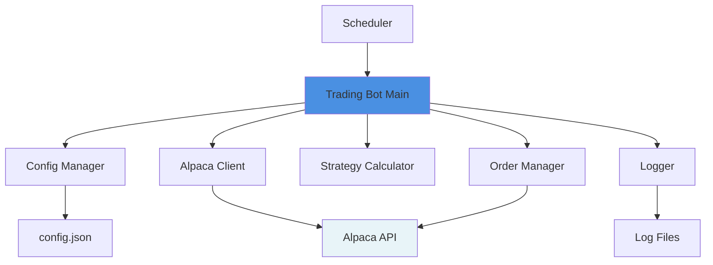
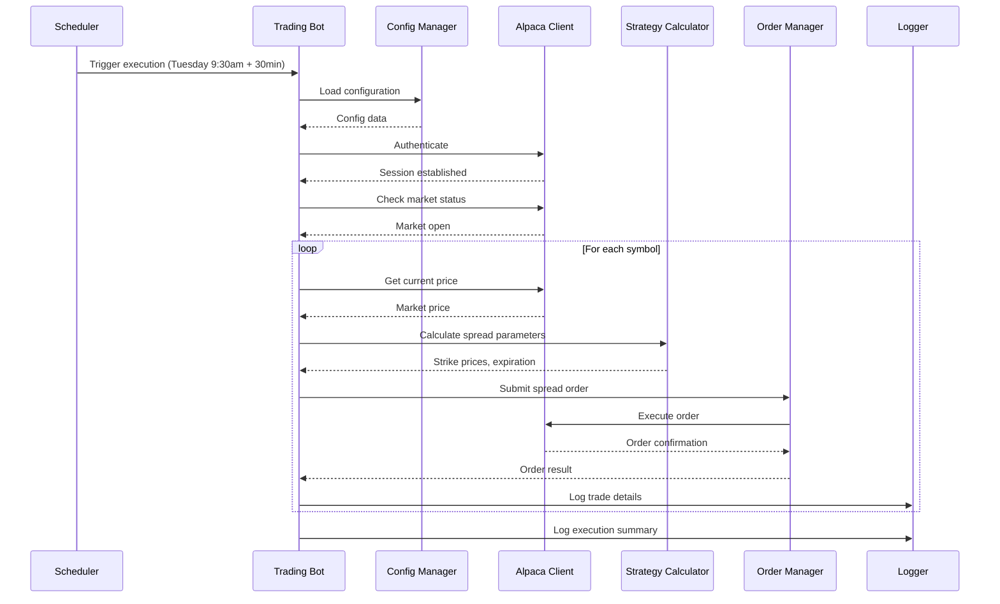

# Design Document: Options Trading Bot

## Overview

The Options Trading Bot is a Python-based automated trading system that executes put credit spread strategies on configurable equity symbols using the Alpaca trading API. The system operates on a scheduled basis, executing trades at a specified time each week with configurable parameters for risk management and position sizing.

The bot follows a modular architecture with clear separation of concerns: configuration management, market data retrieval, options strategy calculation, order execution, and logging. This design ensures maintainability, testability, and ease of configuration updates.

## Architecture

### High-Level Architecture



### Component Interaction Flow



## Components and Interfaces

### 1. Configuration Manager

**Responsibility**: Load, validate, and provide access to configuration parameters.

**Interface**:
```python
class ConfigManager:
    def load_config(self, config_path: str) -> Config
    def validate_config(self, config: Config) -> bool
    def get_symbols(self) -> List[str]
    def get_strike_offset_percent(self) -> float
    def get_spread_width(self) -> float
    def get_contract_quantity(self) -> int
    def get_execution_day(self) -> str
    def get_expiration_offset_weeks(self) -> int
    def get_alpaca_credentials(self) -> AlpacaCredentials
```

**Configuration File Structure** (config.json):
```json
{
  "symbols": ["NVDA", "GOOGL", "AAPL", "MSFT"],
  "strike_offset_percent": 5.0,
  "spread_width": 5.0,
  "contract_quantity": 1,
  "execution_day": "Tuesday",
  "execution_time_offset_minutes": 30,
  "expiration_offset_weeks": 1,
  "alpaca": {
    "api_key": "${ALPACA_API_KEY}",
    "api_secret": "${ALPACA_API_SECRET}",
    "base_url": "https://paper-api.alpaca.markets"
  },
  "logging": {
    "level": "INFO",
    "file_path": "logs/trading_bot.log"
  }
}
```

### 2. Alpaca Client

**Responsibility**: Interface with Alpaca API for authentication, market data, and order execution.

**Interface**:
```python
class AlpacaClient:
    def __init__(self, api_key: str, api_secret: str, base_url: str)
    def authenticate(self) -> bool
    def is_market_open(self) -> bool
    def get_market_open_time(self) -> datetime
    def get_current_price(self, symbol: str) -> float
    def get_option_chain(self, symbol: str, expiration: date) -> List[OptionContract]
    def submit_spread_order(self, spread: SpreadOrder) -> OrderResult
    def get_account_info(self) -> AccountInfo
```

**Dependencies**: 
- alpaca-trade-api Python library
- Handles API rate limiting and connection management

### 3. Strategy Calculator

**Responsibility**: Calculate strike prices, expiration dates, and spread parameters based on market data and configuration.

**Interface**:
```python
class StrategyCalculator:
    def __init__(self, config: Config)
    def calculate_short_strike(self, current_price: float, offset_percent: float) -> float
    def calculate_long_strike(self, short_strike: float, spread_width: float) -> float
    def calculate_expiration_date(self, execution_date: date, offset_weeks: int) -> date
    def find_nearest_strike(self, target_strike: float, available_strikes: List[float]) -> float
    def validate_spread_parameters(self, spread: SpreadParameters) -> bool
```

**Key Logic**:
- Short strike = current_price * (1 - offset_percent / 100), rounded to nearest available strike
- Long strike = short_strike - spread_width, rounded to nearest available strike
- Expiration = Friday of the week that is `offset_weeks` after execution date
- Validates that strikes are available in the option chain

### 4. Order Manager

**Responsibility**: Construct and submit spread orders with retry logic and error handling.

**Interface**:
```python
class OrderManager:
    def __init__(self, alpaca_client: AlpacaClient, logger: Logger)
    def create_spread_order(self, symbol: str, short_strike: float, long_strike: float, 
                           expiration: date, quantity: int) -> SpreadOrder
    def submit_order(self, order: SpreadOrder) -> OrderResult
    def retry_order(self, order: SpreadOrder, max_retries: int = 3) -> OrderResult
    def validate_order(self, order: SpreadOrder) -> bool
```

**Retry Strategy**:
- Exponential backoff: 1s, 2s, 4s
- Logs each retry attempt
- Returns failure result after max retries exceeded

### 5. Scheduler

**Responsibility**: Trigger bot execution at the configured day and time.

**Interface**:
```python
class Scheduler:
    def __init__(self, config: Config, trading_bot: TradingBot)
    def schedule_execution(self)
    def run(self)
    def stop(self)
```

**Implementation**:
- Uses `schedule` library for Python
- Calculates execution time as market open + configured offset minutes
- Runs continuously, checking schedule every minute
- Handles timezone conversions (market time is US/Eastern)

### 6. Trading Bot Main

**Responsibility**: Orchestrate the entire trading workflow.

**Interface**:
```python
class TradingBot:
    def __init__(self, config_path: str)
    def initialize(self)
    def execute_trading_cycle(self)
    def process_symbol(self, symbol: str) -> TradeResult
    def shutdown(self)
```

**Execution Flow**:
1. Load configuration
2. Authenticate with Alpaca
3. Verify market is open
4. For each configured symbol:
   - Get current price
   - Calculate spread parameters
   - Find available strikes in option chain
   - Submit spread order with retry logic
   - Log result
5. Generate execution summary

### 7. Logger

**Responsibility**: Provide structured logging for all bot operations.

**Interface**:
```python
class BotLogger:
    def __init__(self, config: LoggingConfig)
    def log_info(self, message: str, context: dict = None)
    def log_warning(self, message: str, context: dict = None)
    def log_error(self, message: str, error: Exception = None, context: dict = None)
    def log_trade(self, trade: TradeResult)
    def log_execution_summary(self, summary: ExecutionSummary)
```

**Log Format**:
```
[2025-11-24 10:00:00] [INFO] Starting trading cycle
[2025-11-24 10:00:01] [INFO] Market status: OPEN
[2025-11-24 10:00:02] [INFO] Processing symbol: NVDA | Price: $145.50
[2025-11-24 10:00:03] [INFO] Calculated strikes: Short=$138.00, Long=$133.00, Exp=2025-12-06
[2025-11-24 10:00:05] [INFO] Order submitted: NVDA | Status=FILLED | Contracts=1
[2025-11-24 10:00:15] [ERROR] Order failed: GOOGL | Error=Invalid strike price
[2025-11-24 10:00:30] [INFO] Execution complete | Success=3, Failed=1
```

## Data Models

### Config
```python
@dataclass
class Config:
    symbols: List[str]
    strike_offset_percent: float
    spread_width: float
    contract_quantity: int
    execution_day: str
    execution_time_offset_minutes: int
    expiration_offset_weeks: int
    alpaca_credentials: AlpacaCredentials
    logging_config: LoggingConfig
```

### SpreadOrder
```python
@dataclass
class SpreadOrder:
    symbol: str
    short_strike: float
    long_strike: float
    expiration: date
    quantity: int
    order_type: str = "limit"
    time_in_force: str = "day"
```

### TradeResult
```python
@dataclass
class TradeResult:
    symbol: str
    success: bool
    order_id: Optional[str]
    short_strike: float
    long_strike: float
    expiration: date
    quantity: int
    filled_price: Optional[float]
    error_message: Optional[str]
    timestamp: datetime
```

### ExecutionSummary
```python
@dataclass
class ExecutionSummary:
    execution_date: datetime
    total_symbols: int
    successful_trades: int
    failed_trades: int
    trade_results: List[TradeResult]
```

## Error Handling

### Error Categories and Responses

1. **Configuration Errors**
   - Invalid config file format → Log error, terminate
   - Missing required fields → Log error, use defaults where safe, terminate if critical
   - Invalid symbol → Log warning, skip symbol

2. **Authentication Errors**
   - Invalid credentials → Log error, terminate
   - API connection failure → Log error, retry 3 times, terminate if all fail

3. **Market Data Errors**
   - Market closed → Log info, wait until market opens
   - Price data unavailable → Log warning, skip symbol
   - Option chain unavailable → Log warning, skip symbol

4. **Order Execution Errors**
   - Order rejected → Log error, retry up to 3 times with exponential backoff
   - Insufficient buying power → Log error, skip symbol
   - Invalid strike prices → Log error, skip symbol
   - Network timeout → Retry with exponential backoff

5. **Runtime Errors**
   - Unexpected exceptions → Log full stack trace, continue with next symbol
   - Scheduler errors → Log error, attempt to restart scheduler

### Error Recovery Strategy

- **Graceful Degradation**: If one symbol fails, continue processing remaining symbols
- **Retry Logic**: Transient errors (network, timeouts) get 3 retry attempts
- **Fail-Fast**: Critical errors (auth failure, invalid config) terminate immediately
- **Alerting**: All errors logged to file and console for monitoring

## Testing Strategy

### Unit Tests

1. **ConfigManager Tests**
   - Valid config loading
   - Invalid config handling
   - Environment variable substitution
   - Default value application

2. **StrategyCalculator Tests**
   - Strike price calculations with various offsets
   - Expiration date calculations
   - Strike rounding to nearest available
   - Edge cases (very low prices, holidays)

3. **OrderManager Tests**
   - Order construction
   - Retry logic with mocked failures
   - Order validation

4. **AlpacaClient Tests** (with mocking)
   - Authentication flow
   - Market status checks
   - Price retrieval
   - Order submission

### Integration Tests

1. **End-to-End Flow** (with Alpaca paper trading)
   - Full trading cycle execution
   - Multiple symbol processing
   - Error handling across components
   - Configuration changes

2. **Scheduler Tests**
   - Correct timing of execution
   - Timezone handling
   - Market hours validation

### Manual Testing Checklist

- [ ] Verify trades execute on paper trading account
- [ ] Confirm correct strike prices and expirations
- [ ] Test with market closed scenario
- [ ] Test with invalid symbols
- [ ] Test configuration file updates
- [ ] Verify logging output completeness
- [ ] Test authentication failure handling
- [ ] Verify retry logic with simulated failures

## Deployment Considerations

### Environment Setup

1. **Python Environment**
   - Python 3.9+
   - Virtual environment recommended
   - Dependencies: alpaca-trade-api, schedule, python-dotenv

2. **Configuration**
   - Store API credentials in environment variables or secure vault
   - Use paper trading URL for testing
   - Configure appropriate log levels

3. **Execution Environment**
   - Run as background service (systemd, supervisor, or Docker container)
   - Ensure system timezone is set correctly
   - Monitor disk space for logs

### Security Considerations

- Never commit API credentials to version control
- Use environment variables or secret management service
- Restrict file permissions on config files
- Use HTTPS for all API communications
- Implement rate limiting to avoid API throttling

### Monitoring and Maintenance

- Set up log rotation to prevent disk space issues
- Monitor execution summary logs daily
- Set up alerts for consecutive failures
- Review and adjust configuration based on market conditions
- Regularly verify paper trading results before live deployment
